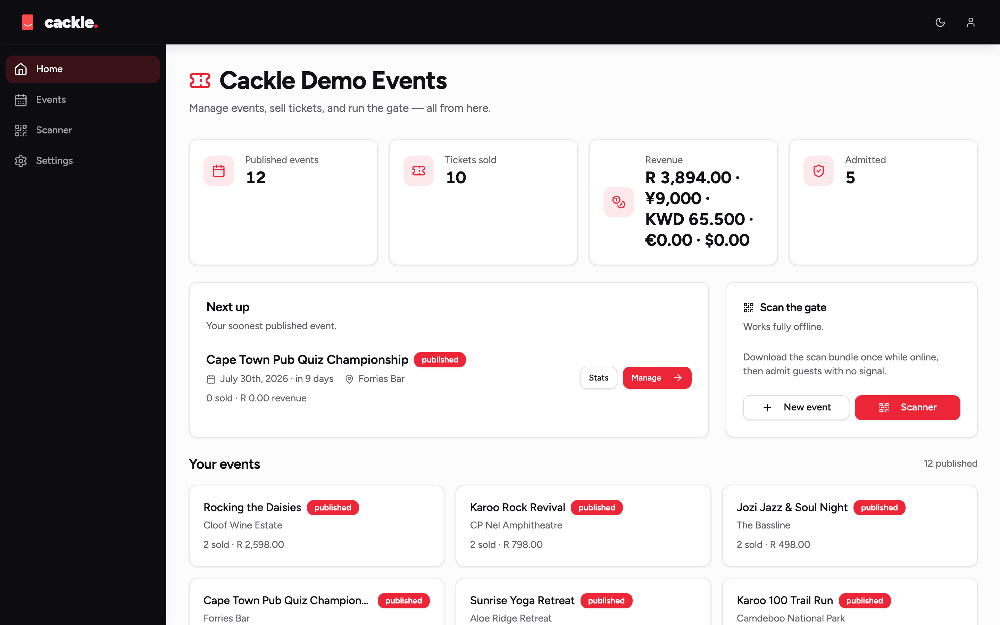
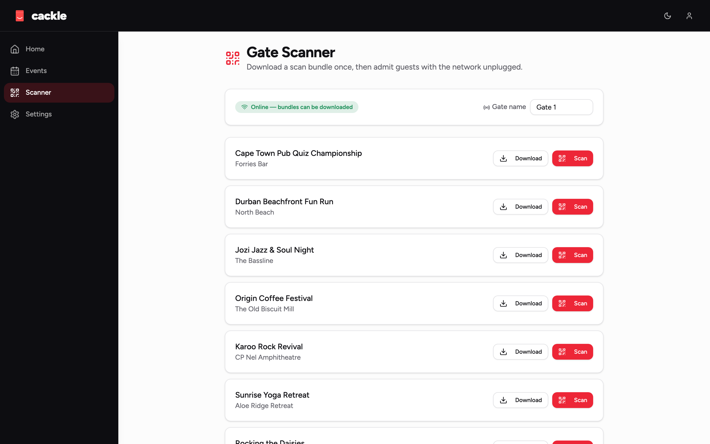
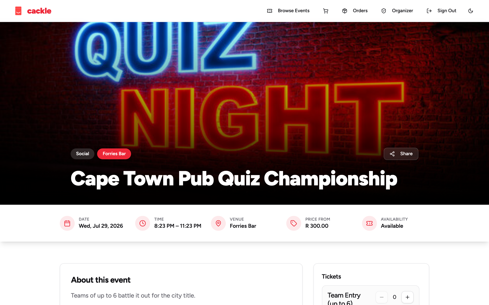
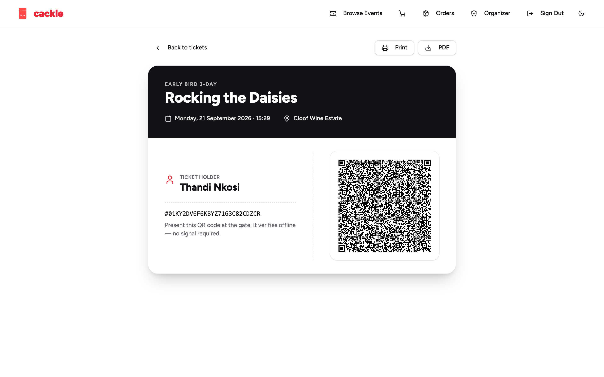
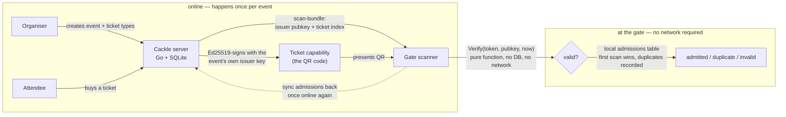

<div align="center">


# Cackle

### Your gate works with no internet.

Events and ticketing in a single Go binary. Organisers create events, attendees
buy tickets and get a signed QR, staff scan at the gate — and the gate keeps
working even if the venue's network, or the server itself, goes down mid-event.

<sub> Part of <strong><a href="https://vulos.org">VulOS</a></strong> — the open, self-hostable web OS &amp; app suite. Runs standalone, or as an app hosted by the Vulos OS.</sub>

[](LICENSE-MIT)
[](https://golang.org)
[](https://react.dev)
[](docs/TICKET-FORMAT.md)
[](https://github.com/vul-os/cackle/actions)

[**Quick start**](#quick-start-standalone) · [**Docs**](docs/) · [**Ticket format**](docs/TICKET-FORMAT.md) · [**Offline gates**](docs/OFFLINE-GATES.md) · [**Roadmap**](ROADMAP.md)

<br/>


</div>

---

> [!WARNING]
> **Experimental — work in progress.** Cackle is a ground-up refactor of an earlier
> ticketing platform onto a single Go binary, and it is **not production-ready**.
> APIs, the database schema, and the ticket format are all still moving; expect
> breaking changes without migrations. Payment provider adapters are built against
> published API documentation and are **unit-tested but not sandbox-verified** unless
> explicitly marked otherwise in [docs/PAYMENTS.md](docs/PAYMENTS.md) — do not take
> real money through an unverified adapter. Do not run a real event on this yet.

## What is Cackle?

Cackle is a **standalone, self-hostable events and ticketing platform** —
organisers create events and ticket types, attendees browse and buy, and staff
scan tickets at the door. It ships as **one Go binary with an embedded SQLite
database and an embedded React frontend**: no separate database server, no
Node process in production, no cloud account required.

The thing that makes it different from every incumbent ticketing platform:
**the gate does not need the internet to admit people.** A ticket is an
Ed25519-signed capability — a compact, self-contained token that a scanner can
verify entirely offline against a pinned public key for that event. The
Cackle server issues tickets and reports sales, but it is **not in the
critical path of admission**. If the venue's Wi-Fi drops, or the box running
Cackle dies outright, gates that already downloaded the event's scan bundle
keep admitting people, deduping locally, and reconciling once the network
comes back.

Cackle is **country and currency agnostic** — there is no privileged
country, currency, or processor. Currency is set per event. The default
provider is `manual`: the organiser records that money arrived (bank
transfer, cash at the door, an invoice, mobile money) with no API key and no
compliance surface, and it works in every country. Every other
processor — Stripe, Paystack, BTCPay, 20-odd others — is an optional,
off-by-default adapter behind one seam (`internal/payments`). **Cackle never
holds funds** — it hands off to a provider (or the organiser, for `manual`)
and records the result. See [docs/PAYMENTS.md](docs/PAYMENTS.md) for the
full adapter list and each one's verification status.

## Part of VulOS

**Vulos = free, open-source software + two paid services.** The Vulos OS, all
its apps (Cackle included), and the app store are **OSS and free — you
self-host them**. You self-provision and self-pay your own box (Fly / Hetzner
/ any VPS / home server); Vulos does **not** host or provision boxes. Vulos
bills for only two things: **Vulos Relay** (reachability) and **backup
storage** (buckets). There is no compute/box billing, no mail billing, and no
app-store subscription.

VulOS is an open, self-hostable web OS + app suite. The **Vulos OS** is the
shell (launcher, windows, dock, assistant) that hosts the apps; each product
also runs independently on its own:

- **Vulos OS** — the web-native desktop shell that hosts the apps
- **Vulos Office** — documents: docs, sheets, slides, PDF, and **whiteboards**
  (the Excalidraw-based whiteboard is an Office **document type** — there is
  **no separate Board product**)
- **Vulos Files** — file storage + P2P sharing, built into the OS
- **Vulos Relay** — sovereign connectivity / reachability fabric
  (`@vulos/relay-client`) — one of the two paid services
- **llmux** — sovereign AI gateway

PIM is **bring-your-own** (Mail / Calendar / Contacts via lilmail + the OS's
Calendar/Contacts widgets); chat and video are **third-party** (Matrix/Element;
Element Call / Jitsi) — not Vulos products.

**Cackle's role:** events and ticketing. It runs standalone **and** is hosted
as an app by the Vulos OS — the same binary, with the OS wiring identity and
scoped storage in front of it.

## Features

| | |
|---|---|
| 🎟️ **Offline-verifiable tickets** | Every ticket is an Ed25519-signed capability, `cackle.<payload>.<sig>`, verified with a pure function — no database, no network, no clock but the one you hand it. This is what lets a gate keep admitting people with no connection. See [docs/TICKET-FORMAT.md](docs/TICKET-FORMAT.md). |
| 🚪 **Offline gate scanning** | A scanner pulls one `scan-bundle` while online (event details, issuer public keys, a ticket index, an allocation) and can then run the whole event unplugged. Admission dedupe is local and append-only — first scan wins, duplicates are recorded, never overwritten. See [docs/OFFLINE-GATES.md](docs/OFFLINE-GATES.md). |
| 🏟️ **Events & ticket types** | Organisations own events; events own ticket types with pricing, quantity caps, sales windows, and per-order limits. Draft → published → cancelled lifecycle. |
| 🛒 **Orders & checkout** | Cart-style checkout against live ticket-type availability, integer minor-unit accounting in the event's own currency (money is never a float), per-order item breakdown. |
| 💳 **Pluggable payments** | A small `Provider` interface (`Begin` / `Verify` / `Webhook` / `Capabilities`) behind every charge. `manual` is the always-on default (no API key, works anywhere); 20+ optional adapters (Stripe, Paystack, BTCPay, LNbits, and more) are off by default and enabled per deployment via `CACKLE_PAYMENT_PROVIDERS`. Webhooks verify signatures and fail closed. Cackle never holds funds. See [docs/PAYMENTS.md](docs/PAYMENTS.md). |
| 👥 **Org roles** | `owner` / `admin` / `scanner` per organisation, checked server-side on every event/org route — including the ones an incumbent platform forgot to guard. |
| 📈 **Live stats** | Sold, revenue, admitted count, and a per-ticket-type breakdown per event. |
| 📦 **One binary, one file database** | `modernc.org/sqlite` (pure Go, no cgo) plus the built React app embedded via `embed.FS`. `docker run -p 8080:8080 vulos/cackle` is the whole install. |

## Screenshots

<table>
<tr>
<td width="50%"><br><sub><em>Organiser dashboard — sales, revenue, and admissions for an event</em></sub></td>
<td width="50%"><br><sub><em>Gate scanner — admits, dedupes, and works with no network</em></sub></td>
</tr>
<tr>
<td width="50%"><br><sub><em>Public event page — ticket types and availability</em></sub></td>
<td width="50%"><br><sub><em>Attendee ticket — the QR is the signed capability itself</em></sub></td>
</tr>
</table>

Full gallery, including dark mode, in [docs/SCREENSHOTS.md](docs/SCREENSHOTS.md).

## Quick start (standalone)

```bash
git clone https://github.com/vul-os/cackle.git
cd cackle
docker build -t vulos/cackle .
docker run -d --name cackle -p 8080:8080 -v cackle-data:/srv/data vulos/cackle
# open http://localhost:8080
```

Or build the real single binary yourself (`make build` builds the frontend,
embeds it into the Go binary, and outputs `./cackle`) and run demo mode —
fully seeded, zero setup:

```bash
make build
./cackle --demo
# open http://localhost:8080
```

`go build -o cackle ./cmd/cackle` also compiles (useful for fast
backend-only iteration), but without the `embed_frontend` build tag it
serves a bare dev fallback instead of the real UI — use `make build` (or
`make build-backend` if you specifically want the no-UI binary) to get the
one Go embeds the whole frontend into. See the [`Dockerfile`](Dockerfile)
"EMBED CONTRACT" comment for why.

`--demo` boots with a seeded organisation, a published event, ticket types,
and the `stub` payment provider so you can buy a ticket and scan it end to
end without touching a real payment processor. See
[docs/GETTING-STARTED.md](docs/GETTING-STARTED.md) for a real (non-demo)
setup, and [docs/SELF-HOSTING.md](docs/SELF-HOSTING.md) for running it for a
real event.

## How it works

Everything that matters for **admission** happens without the server: an
event's issuer key is fetched once while a scanner is online, and every
ticket after that verifies locally.



`internal/tickets` owns the capability format and is the one place signature
and expiry logic lives; `internal/scan` owns admission and the offline
dedupe table. Full write-up: [docs/ARCHITECTURE.md](docs/ARCHITECTURE.md).

## Configuration

Env-first, every key prefixed `CACKLE_`. Flags mirror the env vars; nothing
requires a config file.

| Variable | Default | Description |
|---|---|---|
| `CACKLE_ADDR` | `:8080` | HTTP listen address |
| `CACKLE_DB` | `./cackle.db` | SQLite file path |
| `CACKLE_BASE_URL` | — | Public base URL, used in links and payment callbacks |
| `CACKLE_SESSION_SECRET` | auto-generated, persisted | Session signing secret |
| `CACKLE_PAYMENT_PROVIDERS` | unset (every registered provider enabled) | Comma-separated allowlist of optional payment providers for this deployment, e.g. `manual,stripe,paystack`. `manual` is always enabled regardless. |
| `CACKLE_DEMO` | `false` | Boot fully seeded with demo data (same as `--demo`) |

Each optional payment provider has its own `CACKLE_<PROVIDER>_*` secrets
(e.g. `CACKLE_STRIPE_SECRET_KEY`, `CACKLE_PAYSTACK_SECRET_KEY`) — see
[docs/PAYMENTS.md](docs/PAYMENTS.md) for the full per-adapter list and
[docs/CONFIGURATION.md](docs/CONFIGURATION.md) for the complete reference.

Full reference: [docs/CONFIGURATION.md](docs/CONFIGURATION.md).

## Documentation

| Document | What it covers |
|---|---|
| [docs/GETTING-STARTED.md](docs/GETTING-STARTED.md) | Clone to first ticket scanned: build, configure, run |
| [docs/ARCHITECTURE.md](docs/ARCHITECTURE.md) | Layout, request flow, the contract behind every package |
| [docs/CONFIGURATION.md](docs/CONFIGURATION.md) | Every env var / flag, defaults, and what requires a restart |
| [docs/API.md](docs/API.md) | The full HTTP API the frontend (and any client) codes against |
| [docs/TICKET-FORMAT.md](docs/TICKET-FORMAT.md) | The ticket capability format and why offline verification works — read this first |
| [docs/OFFLINE-GATES.md](docs/OFFLINE-GATES.md) | Running a gate with no network: scan-bundle, allocations, sync |
| [docs/PAYMENTS.md](docs/PAYMENTS.md) | The payment provider seam, the full adapter table + verification status, `manual` by default, why Cackle never holds funds |
| [docs/SCREENSHOTS.md](docs/SCREENSHOTS.md) | Full screenshot gallery and how to regenerate it |
| [docs/SELF-HOSTING.md](docs/SELF-HOSTING.md) | Running Cackle for a real event: Docker, backups, TLS, scaling the gate |
| [ROADMAP.md](ROADMAP.md) | What v1 ships, and what's deliberately deferred |
| [CHANGELOG.md](CHANGELOG.md) | Version history |

## Development

Prerequisites: Go 1.25+, Node 20+.

```bash
# Backend — note: NOT bare `./...`. web/node_modules can contain a stray
# vendored .go file (e.g. a nested npm package's Go port); scope to the
# real Go packages.
go vet ./cmd/... ./internal/...
go test ./cmd/... ./internal/...

# Frontend
cd web && npm install && npm run dev
```

`make check` runs the same gate CI does (lint + test + full build) in one
command.

```bash
# Regenerate screenshots (Playwright, builds the binary, boots --demo on :8087)
# — run from the repo root, where the screenshots script + its devDependency live
npm install && npx playwright install chromium
npm run screenshots
```

## Contributing

Contributions are welcome. See [CONTRIBUTING.md](CONTRIBUTING.md) for the
dev-environment setup, branch conventions, and what we say yes and no to. See
[SECURITY.md](SECURITY.md) to report a vulnerability.

## License

[MIT](LICENSE-MIT) OR [Apache-2.0](LICENSE-APACHE) — © VulOS. Cackle is a
VulOS project; source and issues at
[github.com/vul-os/cackle](https://github.com/vul-os/cackle).

---

<div align="center">
<sub> Part of <strong><a href="https://vulos.org">VulOS</a></strong> — the open, self-hostable web OS &amp; app suite.</sub>
</div>
