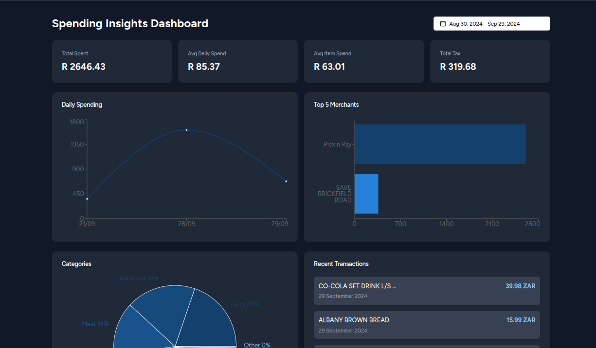

# Getting Started

Welcome to our platform! This guide will help you understand the basics and get up and running quickly.



## Quick Start

Follow these simple steps to start building:

1. Install via npm:
```bash
npm install our-platform
```

2. Create a new project:
```bash
npx create-platform-app my-app
cd my-app
```

3. Start the development server:
```bash
npm run dev
```


## Key Features

Our platform provides everything you need:

- ⚡️ **Lightning Fast**: Built on cutting-edge technology
- 🛠️ **Customizable**: Adapt to your needs
- 📱 **Responsive**: Works on all devices
- 🔒 **Secure**: Enterprise-grade security

## Installation Options

Choose the installation method that works best for you:

### NPM
```bash
npm install our-platform
```

### Yarn
```bash
yarn add our-platform
```

### Docker
```bash
docker pull our-platform
docker run -p 3000:3000 our-platform
```

## Prerequisites

Before you begin, ensure you have:

- Node.js 16 or higher
- npm or yarn
- Basic knowledge of React