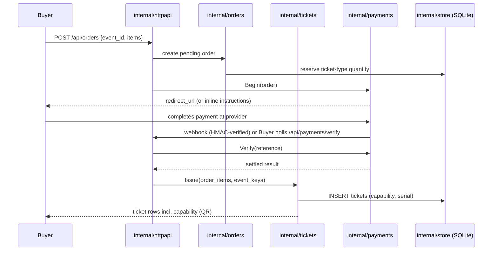
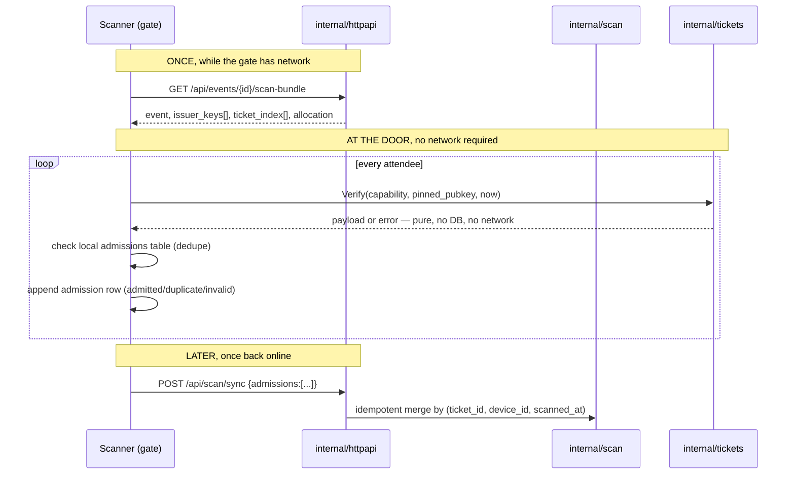
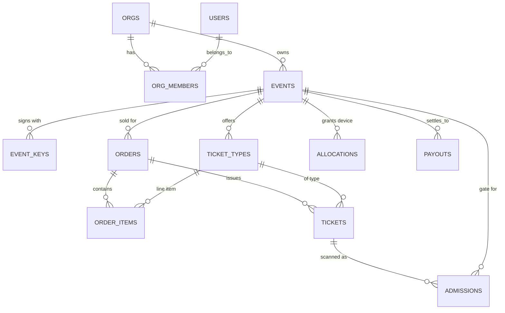

# Architecture

This is the binding contract for Cackle's structure — what goes where, and
why. If you're changing anything structural, read this first.

## The one sentence

**A ticket is a signed capability a gate can verify without asking anyone —
the server issues them, but it is not in the critical path of admission.**
Everything else in this document exists to protect that property.

## Non-negotiables

- **One static Go binary.** `modernc.org/sqlite` (pure Go, no cgo) for
  storage, the built React frontend embedded via `embed.FS`. `docker run -p
  8080:8080 vulos/cackle` is the entire install story.
- **`./cackle --demo` boots fully seeded with zero setup.** The screenshotter
  and anyone kicking the tyres for the first time depend on this.
- **No hard runtime dependency** on Supabase, Firebase, Vulos Relay, Vulos
  CP, or DMTAP. Cackle runs standalone, full stop.
- Go 1.25. Frontend is JSX, not TSX — a house-wide VulOS invariant.
- MIT licence. Module path `github.com/vul-os/cackle`.
- Money is **integer cents**, never a float. Currency defaults to `ZAR`.
- IDs are ULIDs (sortable, so `ORDER BY id` is `ORDER BY created_at` for
  free). Timestamps are RFC3339 text, the SQLite convention.

## Layout

```
cmd/cackle/main.go
internal/store/      SQLite open + migrations + queries
internal/auth/       users, sessions, password, OAuth seam
internal/events/     orgs, events, ticket types
internal/tickets/    ISSUANCE + Ed25519 capability sign/verify  ← the differentiator
internal/orders/     cart, orders, order items
internal/payments/   Provider seam + paystack + stub
internal/scan/       gate admission, offline dedupe, allocations
internal/httpapi/    chi router, handlers, middleware
internal/demo/       seed data for --demo
web/                 React 18 + Vite + Tailwind + shadcn (JSX)
docs/  scripts/  site/  .github/workflows/
```

This layout is fixed. Packages don't import sideways into each other's
internals; they compose in `internal/httpapi` and `cmd/cackle/main.go`.

## Request flow

Two flows matter: **selling a ticket** (always online, always through the
server) and **admitting a ticket** (online once, then never again per gate,
until sync).





## Package responsibilities

- **`internal/store`** — owns the SQLite connection, runs numbered
  migrations (`0001_...`) on boot, and hosts hand-written query helpers.
  Nothing outside this package touches `database/sql` directly.
- **`internal/auth`** — users, password hashing (argon2id or bcrypt),
  sessions (32 random bytes, stored hashed, never in plaintext), an OAuth
  seam via `oauth_identities`.
- **`internal/events`** — orgs, org membership/roles, events, ticket types.
  Owns the draft → published → cancelled lifecycle and ticket-type
  inventory (`quantity_total` / `quantity_sold`).
- **`internal/tickets`** — the differentiator. Issues and verifies the
  ticket capability format (see [TICKET-FORMAT.md](TICKET-FORMAT.md)). This
  package's `Verify` function is pure: no DB handle, no network client, no
  implicit clock. That purity is the entire reason offline scanning works,
  and it is a contract violation to add any of those three things to it.
- **`internal/orders`** — cart-shaped checkout, orders, order items,
  integer-cents totals.
- **`internal/payments`** — the `Provider` interface (`Begin` / `Verify` /
  `Webhook`) plus concrete adapters. See [PAYMENTS.md](PAYMENTS.md).
- **`internal/scan`** — gate admission: looks up a ticket, dedupes against
  the local `admissions` table (unique on `ticket_id`, first scan wins,
  every subsequent scan recorded as its own `duplicate` row rather than
  overwritten), and the offline `allocations` bookkeeping a device
  used while running unplugged.
- **`internal/httpapi`** — chi router, middleware (auth, CSRF, rate
  limiting, security headers), and handlers that compose the packages
  above. This is the only package that knows about HTTP.
- **`internal/demo`** — seed data so `--demo` (and the screenshotter) boot
  with a populated org, event, ticket types, and orders with zero manual
  setup.

## Data model

Full column-level definitions live in the migrations
(`internal/store/migrations/*.sql`); the shape:



Notes that matter more than the diagram:

- **`event_keys` is per event, never global.** An event's Ed25519 keypair is
  the root of trust for every ticket issued under it. A compromised key
  compromises one event, not the platform.
- **`admissions` is append-only.** A duplicate scan is a new row with
  `result='duplicate'`, not an overwrite. This is what makes the offline
  sync endpoint idempotent and auditable — you can always reconstruct what
  happened at every gate, in order.
- **`allocations`** exists so a scanner can be handed a bounded, signed claim
  ("this device may admit up to N more of ticket-type X") for scenarios
  where even the scan-bundle's ticket index isn't precise enough — the seam
  the capacity-delegation roadmap item builds on.

## Security bar

- Passwords: argon2id or bcrypt.
- Sessions: 32 random bytes, stored hashed, compared in constant time.
- CSRF protection on every cookie-auth mutation.
- **RBAC checked server-side on every org/event route, no exceptions.** The
  original app had at least one unprotected admin/payouts-style route — that
  class of bug is exactly what this rule exists to prevent. See
  [SECURITY.md](../SECURITY.md).
- Rate limiting on auth and scan endpoints.
- Security headers + CSP on every response.
- No secret ever appears in a log line.
- SQL via parameterised queries only — no string-built SQL, anywhere.

## Configuration

See [CONFIGURATION.md](CONFIGURATION.md) for the full reference. Everything
is env-first (`CACKLE_*`), flags mirror env vars, and no config file is
required.

## Why standalone-first

Cackle must build and run with nothing else present — no Vulos OS, no
Vulos Relay, no Vulos control plane, no DMTAP node. When Cackle runs *as* a
Vulos OS app, the OS wires identity and scoped storage in front of the same
binary; it never becomes a build-time dependency. See the [README's "Part of
VulOS" section](../README.md#part-of-vulos) for the product framing, and the
[VulOS product standard] for the house-wide rule this follows.

[VulOS product standard]: https://github.com/vul-os
