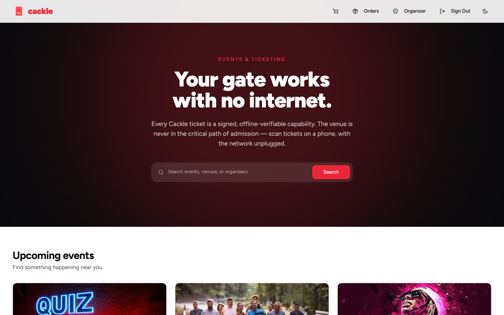
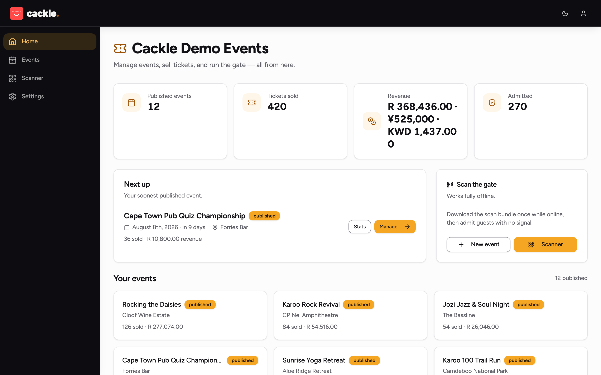
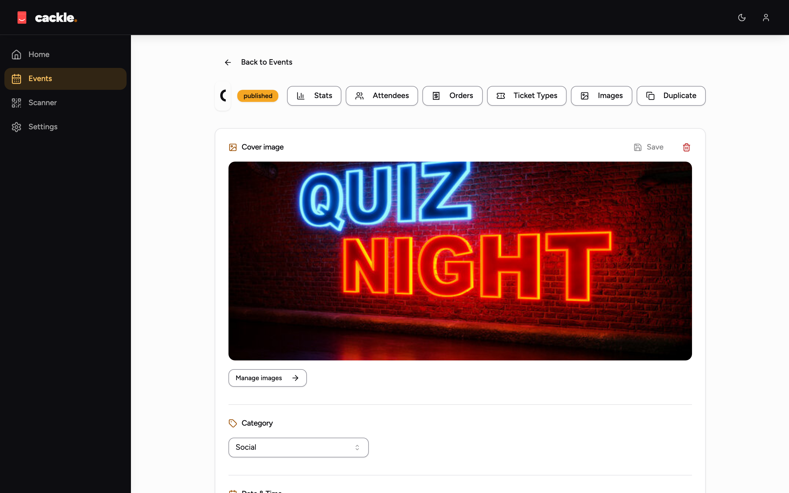
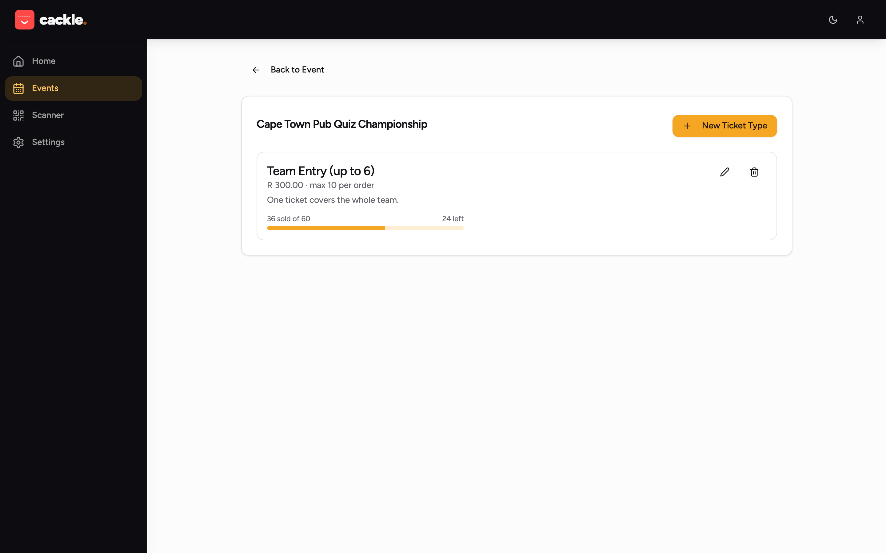
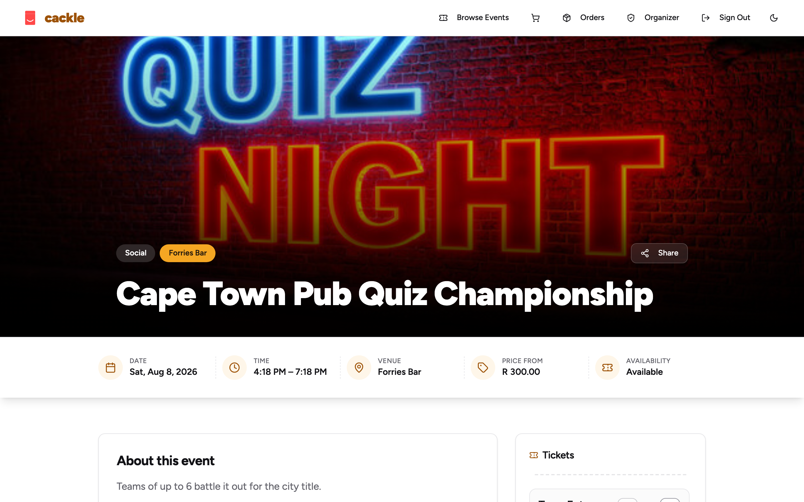
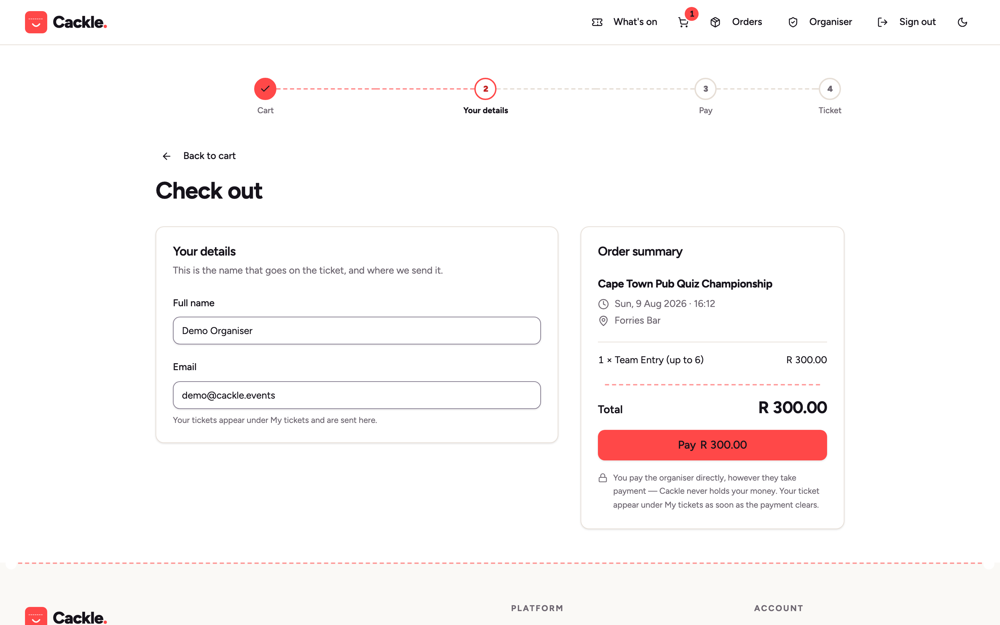
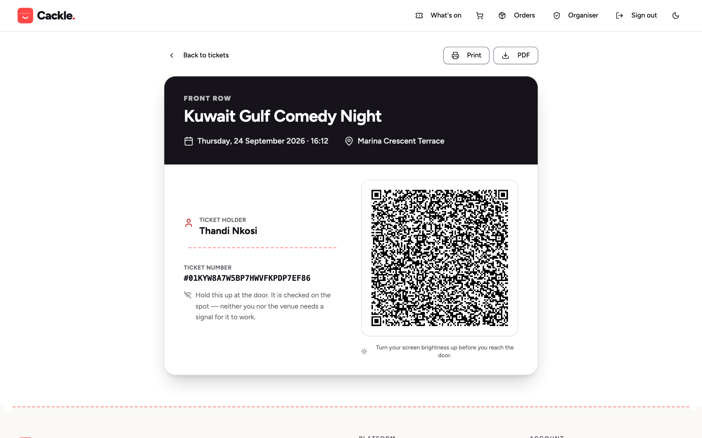
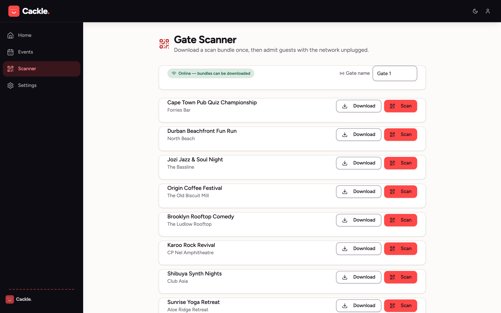
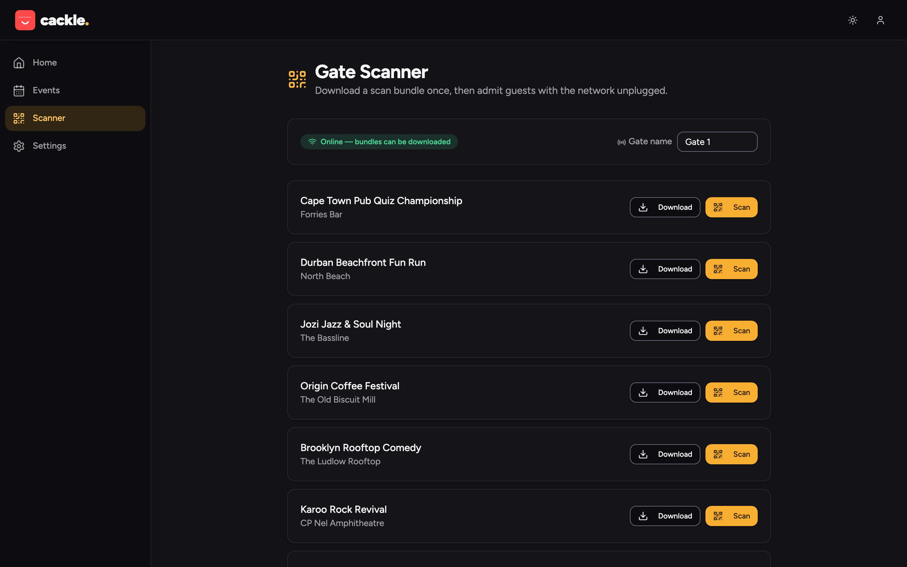

# Getting Started

**In plain English:** this page gets you from nothing to a working Cackle —
first with fake demo data so you can click around, then for real: your own
event, a ticket sold, a ticket scanned at the door. Every command is exact;
every step says what you should see next, and what to do if it doesn't look
right.

> [!WARNING]
> Cackle is **experimental and not production-ready.** Read that as: use it
> to evaluate, don't bet a real event's box office on it yet. See the warning
> at the top of the [README](../README.md) for the full picture, including
> which payment providers are safe to take real money through.

## What problem this actually solves

Say the plainest version out loud once, because everything below exists to
make it true: **the wifi died at the door. People still got in.**

A Cackle ticket is a little signed piece of data, not a row in a database
that a scanner has to ask permission to check. A scanner downloads what it
needs once, before doors open, and after that it doesn't need the internet,
the venue's wifi, or even Cackle's own server to still be running. It checks
each ticket itself, on the device, in your hand. If the server falls over
mid-event, or the wifi drops, the gate keeps working.

That's the whole pitch. Everything after this paragraph is the mechanics of
trying it out.

## Before you start: pick a path

| You have... | Do this |
|---|---|
| Docker | [Option 1 — Docker](#option-1-docker) — one build, one run |
| Go 1.25+ and Node 20+ installed | [Option 2 — build it yourself](#option-2-build-it-yourself) — same result, no Docker needed |
| Neither, and just want to look at screenshots | Scroll to [What you'll see once it's open](#what-youll-see-once-its-open) below |

Both options land you on the same thing: Cackle running on your machine at
`http://localhost:8080`, seeded with a fake organisation, a fake event, and
fake ticket buyers — safe to click anything.

## Option 1: Docker

```bash
git clone https://github.com/vul-os/cackle.git
cd cackle
docker build -t vulos/cackle .
```

**What you should see:** a few minutes of build output (it's compiling the
frontend, then the Go binary, then packaging both into an image) ending in
something like `Successfully tagged vulos/cackle:latest` (or the newer
`buildx` equivalent, `naming to docker.io/library/vulos/cackle:latest done`).
If it stops partway with an error, see [If a step fails](#if-a-step-fails)
below — the most common cause is Docker Desktop not running yet.

```bash
docker run -d --name cackle -p 8080:8080 -e CACKLE_DEMO=true -v cackle-data:/srv/data vulos/cackle
```

**What you should see:** a long container ID printed, and the command
returns immediately (`-d` means "detached" — it's running in the
background). Open **http://localhost:8080** in a browser.

**What you should see there:** the Cackle homepage, with a couple of fake
events already listed under "Featured" or "Upcoming" — see the screenshot
below. If the page doesn't load, wait a few seconds and retry; the container
takes a moment to open its database and run its first-boot migrations.

There's no published Cackle image to pull from a registry yet (this project
hasn't cut a release), which is why the command above builds the image
locally first rather than pulling one — that's the honest current state, not
a missing step you skipped.

## Option 2: build it yourself

```bash
git clone https://github.com/vul-os/cackle.git
cd cackle
make build
```

**What you should see:** `make build` runs the frontend build (`web/`),
embeds it into the Go binary, and leaves a single `./cackle` file at the
repo root. It takes a minute or two the first time (downloading Node and Go
dependencies); faster on repeat runs. See the "EMBED CONTRACT" comment at
the top of the [`Dockerfile`](../Dockerfile) if you're curious exactly what
the embedding step does.

```bash
./cackle --demo
```

**What you should see:** a few lines of startup log ending in something
like `serving on :8080`, plus a printed demo login (email and a generated
password) if you don't already know it — the seeded demo login is
`demo@cackle.events` / `demo1234` either way. The process keeps running in
your terminal; open a new terminal tab (or add `&` to background it) to keep
going. Open **http://localhost:8080**.

### If a step fails

| Symptom | Likely cause | Fix |
|---|---|---|
| `docker: command not found` | Docker isn't installed | Install [Docker Desktop](https://www.docker.com/products/docker-desktop/), start it, retry |
| `Cannot connect to the Docker daemon` | Docker is installed but not running | Open Docker Desktop, wait for it to say "running", retry |
| `port is already allocated` / connection refused on 8080 | Something else is already using port 8080 (maybe an earlier Cackle run) | `docker rm -f cackle` if it's an old Cackle container, or run this one on another port: `-p 8081:8080`, then open `localhost:8081` |
| `go: command not found` or `npm: command not found` | Missing Go 1.25+ or Node 20+ | Install them ([go.dev](https://go.dev/dl/), [nodejs.org](https://nodejs.org/)), retry `make build` |
| The page loads but looks broken/unstyled | You ran `go build` directly instead of `make build` | See [the note below](#for-developers-faster-backend-only-iteration) — a bare `go build` skips embedding the real UI on purpose, for fast backend-only development |
| Nothing after a while, no error either | Rare — usually a stuck container from a previous attempt | `docker rm -f cackle` and re-run the `docker run` command |

If none of that explains it, the [`Dockerfile`](../Dockerfile) and
[`Makefile`](../Makefile) are short enough to read directly, or open an
issue with the exact command and output.

## What you'll see once it's open



That's the public homepage — what an attendee sees, no login required.
Sign in (top right) with the seeded demo account to see the organiser side:



From here you can look at an event's ticket types, its live sales stats, its
attendee list, and the scanner — all seeded, all safe to click. Nothing you
do in `--demo` mode touches anything real: demo mode always uses a fake
"stub" payment provider that auto-settles instantly, specifically so you
can't accidentally take real money while kicking the tyres.

That's evaluation mode. The next section is the real thing.

## Your first real event, start to finish

This section walks the *whole* loop for a real (non-demo) event: an
organisation, an event, ticket types, publishing it, someone actually buying
a ticket, you marking that payment received, the ticket being issued, and a
gate admitting it — offline. If you only want to understand what Cackle
does, `--demo` above already showed you the shape of it. This section is for
when you're actually about to run something.

> [!IMPORTANT]
> **A rough edge to know about before you start: there is currently no
> button to create your first organisation.** Signing up only creates a
> user account — attaching that account to an organisation (which is what
> lets you create events) has to be done once, directly against the
> database, because that piece of the product hasn't been built yet. This
> is stated here rather than glossed over: if you hit the "No organization
> yet" screen after signing up, this is why, not something you did wrong.
> See [step 2](#2-the-one-time-database-step-creating-your-organisation)
> below for the exact, one-time fix. Everything after that step works
> through the ordinary web interface.

### 1. Run Cackle for real (not `--demo`)

Real mode needs somewhere to keep money-signing keys safe. Pick a passphrase
(12+ characters, write it down somewhere safe — losing it means that
database can never issue another ticket, though already-issued tickets keep
working):

```bash
CACKLE_ADDR=:8080 \
CACKLE_DB=./cackle.db \
CACKLE_BASE_URL=http://localhost:8080 \
CACKLE_KEY_PASSPHRASE="a passphrase only you know, twelve characters or more" \
./cackle
```

**What you should see:** a startup log with no `--demo` banner this time,
ending in `serving on :8080`. Open `http://localhost:8080/signup` and create
an account with your own email and a password. **What you should see:** a
"No organization yet" page — that's the rough edge above, not a bug you
triggered.

(Running for real over the public internet, with TLS and a proper reverse
proxy, is [SELF-HOSTING.md](SELF-HOSTING.md) — this section is about
learning the flow locally first.)

### 2. The one-time database step: creating your organisation

Cackle's whole database is one SQLite file (`./cackle.db` above). Stop the
`./cackle` process (Ctrl-C), then run:

```bash
sqlite3 ./cackle.db <<'SQL'
INSERT INTO orgs (id, name, slug, created_at)
  VALUES ('org_1', 'My Venue', 'my-venue', datetime('now'));
INSERT INTO org_members (org_id, user_id, role, created_at)
  VALUES ('org_1',
          (SELECT id FROM users WHERE email = 'you@example.com'),
          'owner', datetime('now'));
SQL
```

Replace `you@example.com` with the email you just signed up with, and
`My Venue` / `my-venue` with your own organisation's name and a URL-safe
slug (letters, numbers, hyphens). If your system doesn't have the `sqlite3`
command, this is a good moment to ask a technically-minded friend for five
minutes — it's two lines, and you only ever run it once per organisation.

Restart `./cackle` with the same command as step 1, sign back in, and
**what you should see:** the organiser dashboard instead of the dead end —
your organisation, no events yet.

### 3. Create your event

Click **New event** (or go to `/admin/events/new`). Fill in the basics —
title, description, when it starts, where it is, what currency you're
selling in — and add at least one ticket type (name, price, how many
you're printing). You can come back and adjust any of this before you
publish.



### 4. Add or review ticket types



Each ticket type has its own price, quantity cap, and (optionally) a sales
window and a per-order limit. A ticket type priced at zero is a free RSVP —
Cackle treats it exactly like a paid ticket the rest of the way through
(same order, same signed capability, same scan).

### 5. Publish

Hit **Publish** on the event page. Before this, the event only exists to
you (an organiser preview); after, it's live at its own public page —
`/events/your-event-slug`.



That's the page you'd share — on social media, a poster's QR code, wherever
people find out about the event.

### 6. Sell a ticket with `manual` — no payment account needed

Open the event's public page in a private/incognito window (so you're
checking out as a visitor, not as yourself the organiser), pick a ticket
type, and go to checkout.



With no payment provider configured, Cackle uses `manual` automatically —
the buyer sees payment instructions (bank details, cash at the door, an
invoice, whatever you tell them) instead of a card form. There's no API key
to set up and no country where this doesn't work, because no money moves
through Cackle at all: it's a record of "we agreed this is paid," made by
you.

The order is created as **pending** at this point — not paid yet.

### 7. Mark the order paid

Back in your organiser account, go to the event's **Orders** page and find
the pending order. Once the money has actually arrived (however you
arranged it — bank transfer, cash, whatever `manual` meant for this event),
click **Mark paid**. This is the moment tickets get issued — not before.

### 8. The ticket appears — this QR code is the whole point

The buyer's order page now shows their ticket, including the QR code:



That QR code isn't a lookup key into a database — it *is* the ticket. It's a
compact, signed piece of data that a scanner can check entirely on its own,
which is what makes the next two steps possible.

### 9. Before doors: load the scanner

On the device you'll use at the door, sign in and open the **Scanner**
page, pick your event, and press **Download**.



This one download is the only moment the scanner needs the internet. It
pulls everything the device will need to run the whole event — the event's
public key, the current list of valid tickets — and stores it on the
device. Do this **before** the doors open, with time to spare, not while a
queue is forming.

### 10. At the door: scan it, wifi or no wifi

Press **Scan** and point the device at the ticket's QR code.



Try it with the device's wifi turned off. It still works — that's not a
trick, that's the entire feature. The scanner checks the ticket's signature
itself, checks it against the list it downloaded in step 9, and checks its
own local record of who it's already let in. None of that needs a network.

### 11. What happens later, once you're back online

Sync the device's admission log back to the server whenever it next has a
connection (a phone briefly finding signal, a laptop plugged in at the
merch tent). Sales stats and the attendee list catch up automatically.

One thing worth saying plainly, because a ticketing platform that hides it
is lying to you: **if you run two doors and both are offline at the same
time, and someone tries the same ticket at both, Cackle cannot stop the
second door from letting them in.** Two devices that can't talk to each
other can't agree on anything in the moment. What Cackle *can* do is tell
you it happened, clearly, once both devices sync — see
[OFFLINE-GATES.md](OFFLINE-GATES.md#what-offline-double-scan-protection-actually-gives-you)
for exactly what that does and doesn't cover, and for the practical ways to
narrow the gap (mainly: sync opportunistically, and prefer fewer doors over
more when you can).

## Next

- [SELF-HOSTING.md](SELF-HOSTING.md) — running this on a real server:
  backups, TLS, the venue-facing checklist
- [PAYMENTS.md](PAYMENTS.md) — every payment provider Cackle can take money
  through, and which ones are actually safe to use with real money today
- [OFFLINE-GATES.md](OFFLINE-GATES.md) — the full operational guide to
  running a gate with no network, written for whoever's actually staffing
  the door
- [CONFIGURATION.md](CONFIGURATION.md) — every setting, in one table
- [ARCHITECTURE.md](ARCHITECTURE.md) — how the pieces fit together, for
  anyone evaluating or extending the code
- [TICKET-FORMAT.md](TICKET-FORMAT.md) — precisely what that QR code
  contains and why a scanner can trust it alone

### For developers: faster backend-only iteration

```bash
go build -o cackle ./cmd/cackle
./cackle --demo
```

This compiles fine and boots the same backend, but **without** the
`embed_frontend` build tag it serves a bare dev fallback instead of the
built React app — useful when you're only touching Go and don't want to
wait on a frontend build, not useful for looking at the UI. `make
build-backend` is the named target for the same thing.

### For developers: building the frontend from source

If you're changing `web/` and want to see it embedded in a real binary,
build the frontend first so the embedded copy is current, then run the full
build — this is exactly what `make build` automates:

```bash
cd web && npm install && npm run build && cd ..
rm -rf cmd/cackle/dist
cp -r web/dist cmd/cackle/dist
CGO_ENABLED=0 go build -tags embed_frontend -o cackle ./cmd/cackle
rm -rf cmd/cackle/dist
```

Prefer `make build` — it's the same steps, already scripted.

For frontend development with hot reload, run the Vite dev server against a
running Go backend instead of rebuilding on every change:

```bash
# terminal 1
go run ./cmd/cackle --demo

# terminal 2
cd web && npm install && npm run dev
```

The Vite dev server proxies API requests to the Go backend.
